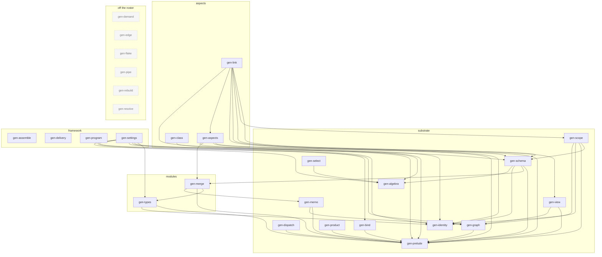
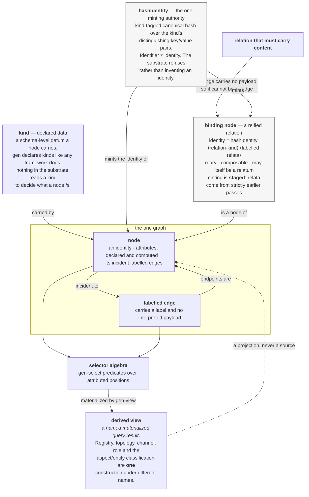
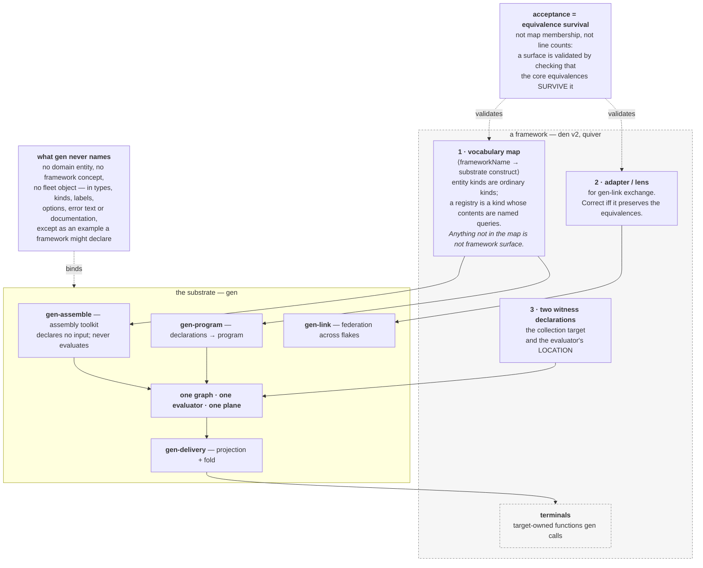

# gen — the architecture

gen is a substrate for building configuration frameworks in Nix. It is not itself a configuration
framework: it declares no domain entity and fixes no vocabulary. What it provides is one graph, one
evaluator, one incremental plane over that evaluator, and an algebra of queries over the graph — plus
the interface through which a framework supplies the names.

This document is for someone who knows Nix and will build a framework on gen. It answers four
questions, one per diagram:

1. [**The library graph**](#1-the-library-graph) — what the libraries are and who consumes whom.
2. [**The model**](#2-the-model) — what a node, a kind, an edge, a relation, a binding and a query are.
3. [**The evaluation pipeline**](#3-the-evaluation-pipeline) — the path from a declaration to a
   delivered target.
4. [**The framework interface**](#4-the-framework-interface) — what a framework declares, and what the
   substrate refuses to name.

Then the [invariants](#5-invariants) every part is subject to, and the
[provenance](#6-provenance) of the theory each construction is taken from.

Two companions: `TERMINOLOGY.md` fixes the vocabulary and its literature provenance; `gen-demo`
(`github:sini/gen-demo`) is the acceptance corpus, a framework declared in invented words that
exercises the substrate end to end. Its constructs are named `C1`…`C17` and cited throughout — each
citation below is a pointer into that corpus, so every claim this document makes about the pipeline
has a declaration a reader can run.

## 1. The library graph

gen is one hub flake (`github:sini/gen`) over a roster of single-concern libraries, each its own
repository and its own flake. The hub pins them, wires them, and re-exports them as one value.

**The roster of record is `lib/mkGenLibs.nix`, never a count and never a list in prose.** The diagram
below is bound to that file by `ci/checks.architecture-library-graph`, in both directions and for
nodes and edges alike: a library that joins or leaves the roster, or an input a member starts or stops
declaring, reddens this check and names itself. The figure cannot fall behind the code without saying
so.

<!-- gen-library-graph:begin -->



<!-- gen-library-graph:end -->

An arrow is a **declared root-flake input**, which is the observable ADR-0015 rules the direction lint
on: a pin bump that changes no declared name changes nothing here, and the lock graph is deliberately
not the source. Re-derive the whole relation in one command:

```bash
nix eval --json ./ci#lib.architectureLibraryGraph.report | jq
```

### The four strata

The subgraph a library sits in is its **stratum**, declared in `lib/mkGenLibs.nix` beside the member
itself. The declaration is total and explicit — a member with no stratum is a build error, never a
silent default — and the four published strata are the consumer paths the hub's `lib` output carries
(`lib.substrate.*`, `lib.modules.*`, `lib.aspects.*`, `lib.framework.*`).

| stratum     | what it is                                                                                                                              | members                                                                                                                                                  |
| ----------- | --------------------------------------------------------------------------------------------------------------------------------------- | -------------------------------------------------------------------------------------------------------------------------------------------------------- |
| `substrate` | the base layer: values, graphs, selection, evaluation                                                                                   | gen-algebra · gen-bind · gen-dispatch · gen-graph · gen-identity · gen-memo · gen-prelude · gen-product · gen-schema · gen-scope · gen-select · gen-view |
| `modules`   | the module system: the checking half and the merging half                                                                               | gen-merge · gen-types                                                                                                                                    |
| `aspects`   | the aspect layer, built on the module system                                                                                            | gen-aspects · gen-class · gen-link                                                                                                                       |
| `framework` | above the stack rather than a layer of it — a framework assembles with these, and no substrate vocabulary may be defined in their terms | gen-assemble · gen-delivery · gen-program · gen-settings                                                                                                 |

**The direction of dependence is the law** (ADR-0015): no member may declare an input above its own
stratum, under `substrate < modules < aspects < framework`. `ci/checks.direction-of-dependence` is the
lint. Exactly one upward edge is ruled through as an exception — `gen-schema (substrate) → gen-merge (modules)`, because gen-schema declares kinds whose fields are options and so is written in the module
system's language while being substrate by role; its retirement carrier is `den-hoag-b91m`, and the
check prints the exception entry by entry on every run rather than hiding it in a pass.

### The role of each library

| library      | stratum   | role                                                                                                                                                                                                                                                                                                                                           | exercised by                                 |
| ------------ | --------- | ---------------------------------------------------------------------------------------------------------------------------------------------------------------------------------------------------------------------------------------------------------------------------------------------------------------------------------------------- | -------------------------------------------- |
| gen-prelude  | substrate | the nixpkgs-lib-free utility base: `builtins` re-exports plus a vendored `lib` subset. It is what lets every library below be nixpkgs-lib-free.                                                                                                                                                                                                | reached as the base; no construct of its own |
| gen-identity | substrate | the **one minting authority** (ADR-0016 ruling 5): `hashIdentity` over a canonical, self-delimiting preimage. Dependency-free by necessity — libraries upstream of gen-schema reach it without closing a flake cycle.                                                                                                                          | C3, C17, through the mint                    |
| gen-algebra  | substrate | pure primitives: the search monad, intensional function equality, the record algebra (`foldLayers`), Either combinators.                                                                                                                                                                                                                       | C13                                          |
| gen-schema   | substrate | typed record registries: declares **kinds**, creates instance registries, derives identity, resolves cross-instance references, computes fields.                                                                                                                                                                                               | C17                                          |
| gen-scope    | substrate | **the sole evaluator** (ADR-0006). Demand-driven attribute evaluation over a scope graph: inherited, synthesized, circular and collection attributes, with a memo cache co-located on each node.                                                                                                                                               | C1, C3, C15, C16                             |
| gen-memo     | substrate | **the one incremental plane** over the evaluator (ADR-0008 §2): a decision layer that never evaluates, only decides reuse. Its definition is byte-parity against a cold evaluation.                                                                                                                                                            | C15, T2b                                     |
| gen-graph    | substrate | accessor-based graph queries: reachability, cycles, transpose, condensation, the labelled-walk regex query, and the ordering front door.                                                                                                                                                                                                       | C2, C12                                      |
| gen-select   | substrate | the selector algebra: `{ __sel = tag; … }` predicates over attributed graph positions, with adapters onto scope, graph, a flat registry and product cells. Every derived view is expressed through it.                                                                                                                                         | C2                                           |
| gen-view     | substrate | the derived-view constructor: it **builds and holds** a materialized query result, where gen-select only answers. Movement, the label algebra and the static well-definedness gate live here. ★ The name is **provisional** — the constructs later descend into a consolidated domain library; take it as a live home, not a stable container. | C4, C7                                       |
| gen-bind     | substrate | binds resolved values into module functions, and owns the crossing's first-order term algebra.                                                                                                                                                                                                                                                 | C14                                          |
| gen-dispatch | substrate | the relational rule-dispatch **step**: a pure function of `(rules, context)` over stratified groups. It owns neither the loop nor the group order.                                                                                                                                                                                             | C10                                          |
| gen-product  | substrate | graph products over the accessor convention — Cartesian, tensor, strong, lexicographic — with cells, slices, fibers, projections, quotients and sparse `restrict`. A product *is* an accessor-graph.                                                                                                                                           | C12                                          |
| gen-types    | modules   | the **checking half**: a type is a predicate boundary — `verify` a value, get `null` or an error string. Primitives, combinators, `struct` with closed-world override, refinement contracts. No merging, no priority, no fixpoint.                                                                                                             | T2b                                          |
| gen-merge    | modules   | the **merging half**: `evalModuleTree` ties the `config` fixpoint, resolves definitions by priority, recurses into structural types and verifies leaves through the injected checkers — reproducing nixpkgs' merge output byte-for-byte with zero nixpkgs.                                                                                     | T2b                                          |
| gen-aspects  | aspects   | the aspect type system: one `aspectType`, dispatch in merge; classifies keys into the `class`, `channel` and `facet` categories, detects guard functions, and flattens a nested tree to a registry by path identity.                                                                                                                           | C11                                          |
| gen-class    | aspects   | the **share class** — an equivalence over members under a caller-supplied `keyOf`, an optimization over sharing. Deliberately **not** the delivery class (ADR-0028).                                                                                                                                                                           | C9                                           |
| gen-link     | aspects   | cross-flake federation: a subgraph packaged and exchanged, with the adapter/lens that ADR-0027 makes the correctness unit of a framework boundary.                                                                                                                                                                                             | C11                                          |
| gen-assemble | framework | the shared framework toolkit: contribution assembly, commutative shape union, structural declarations. **It never evaluates** — it constructs inside the consumer's own evaluation and declares no flake input at all.                                                                                                                         | C8, C16                                      |
| gen-program  | framework | turns a framework's policy declarations into a **program** and reaches the solver. Adjacent to assembly, never inside it.                                                                                                                                                                                                                      | C5                                           |
| gen-delivery | framework | the delivery-class realization surface (ADR-0028): the projection that discovers which declared keys are delivery classes, and the fold that hands each class's collected content to a target-owned terminal.                                                                                                                                  | C6                                           |
| gen-settings | framework | stratified settings resolution: a static `{ default; merge }` schema folded over an ordered layer list, with identity-bearing cross-references as inert data and per-field provenance. Lattice-blind by design — the layer order arrives precomputed.                                                                                          | — none                                       |

Three entries in that last column are honest gaps rather than omissions. gen-prelude is reached as
everyone's base and gen-identity through the mint, so neither has a construct of its own; **gen-settings
has no declaration in the acceptance corpus at all**, and a framework-stratum library with no corpus
declaration is not exercised by the exit.

### What is off the roster

| name        | why it is not a roster member                                                                                                                                                                                                                                                                            |
| ----------- | -------------------------------------------------------------------------------------------------------------------------------------------------------------------------------------------------------------------------------------------------------------------------------------------------------- |
| gen-demand  | retired (ADR-0008 §4): the typed demand cascade re-expresses over gen-scope as claim vocabulary — `mkClaim`, `resolveClaims`.                                                                                                                                                                            |
| gen-rebuild | retired (ADR-0008 §4): its dirty-cone propagation moved onto the gen-memo plane; the library shell and the name retire with the content.                                                                                                                                                                 |
| gen-edge    | retired (ADR-0010 §3): the `(S,T,P,M)` movement contract, its edge-set derivation and its Kahn-ordered materialization land in gen-view, with the ordering arm in gen-graph.                                                                                                                             |
| gen-pipe    | retired (ADR-0010 §3): scoped channels re-express as gen-view constructs; `sel` binds gen-select directly; the determinism and provenance laws are restated as properties of the query construction.                                                                                                     |
| gen-flake   | dissolved (ADR-0031 F2): `compose` to this hub's `lib.compose`, warm/override/trace to gen-memo, projection and `realize` to gen-delivery, inject and terminals to the crossing's adapter set.                                                                                                           |
| gen-resolve | retired (ADR-0008 §4), dispositioned export by export rather than moved as a block: the materialization vocabulary and the reference construct to gen-view, the crossing terminal to gen-bind, the seal-level queries to gen-scope, the reuse key to gen-memo, `attr` and `cascade` dissolved by ruling. |
| gen-harness | **not a library.** It owns `mkCi`, the flake wrapper every gen repo's `ci/` is built from. It pins no gen library — that is what makes it a separate repository, since a library's `ci/` lock would otherwise drag in the aggregator pinning that same library.                                          |
| gen-vars    | experimental, excluded from the inventory by ADR-0003.                                                                                                                                                                                                                                                   |

Removal is not deletion: every retired repository stays readable and keeps its surface, orphaned for
reference (ADR-0031 F3). What leaves with a member is its **obligations**, and those go to a named
destination or are dissolved with a stated reason — the rulings are recorded in `lib/mkGenLibs.nix`
itself, beside the roster, because that is where a reader asks why there is no `edge` key.

## 2. The model

There is **one graph and one node notion** (ADR-0012). Everything else is declared data over it or a
named query result derived from it.



Read the diagram through five commitments.

**A node is a position with attributes and incident labelled edges** — an identity, a set of
attributes (some declared, some computed), and its incident labelled edges. That is the whole of the
node notion, and there is no second one anywhere in the substrate (ADR-0012, quoting R§2.1).

**Kinds are data.** A kind is a schema-level declared datum, declared by gen or by a framework, carried
by a node. It is never a partition of the substrate: `aspect` and `entity` are gen-declared kinds like
any other, and nothing in the substrate reads a kind to decide what a node *is*. The consequence for a
framework is direct — your entity kinds are ordinary kinds, and a registry is a kind whose contents are
named queries (ADR-0027, as amended).

**An edge carries a label and no interpreted payload.** This is what forces reification: any relation
that must carry content cannot be an edge, so it must be a node (ADR-0016 ruling 3). A **binding node**
is exactly that — a reified relation, identified by *what it relates* and *which relation it is*:

```
identity = hashIdentity <relation-kind> { <relatum label> = <that relatum's identity>; … }
```

The relatum's value is its derived **identity**, never its identifier, so identity is not a function of
declared names. The relation kind is required and total, and an empty kind is refused **by name** —
otherwise two distinct relations over the same relata would collapse to one node silently.
Order-insensitivity holds by construction: the pairs are an attrset, attrsets carry no order, and the
canonical preimage emits their keys sorted, so no caller owes a sort. Minting is **staged**: a binding
may relate only nodes minted in a strictly earlier pass, which is why the identity recursion cannot
arise and why a same-pass reference does not resolve rather than diverging (ADR-0016 ruling 7).

**One minting authority, and it refuses rather than invents.** Every node carries an *identifier* or it
cannot be an edge endpoint; identity-bearing kinds additionally carry a *derived* identity, minted by
`hashIdentity` and by nothing else. An ordinary kind derives it from its identity keys **reflected from
its options** — not from a declaration, since a kind's options may be merged from several sources and a
declared key list would duplicate a fact no single author owns. Identity follows Nix `==` in both
directions, which is why the admissible float domain is strictly `|v| < 2^53`: above it Nix's `==` is
not an equivalence relation. `id_hash` is internal addressing only — consistent within an evaluation,
and nothing durable may depend on it across evaluations.

**Every derived view is a named materialized query result** over the selector algebra. A projection is
not merely disqualified as a source — it has a name and a defining query, or it is not a view. The
aspect registry, a topology, a channel, a role: one construction under different names. This is also
why function-resolvers-as-interface is rejected — a fact sealed inside an opaque closure is not
derivable, and the query gates are properties of a query language, which a per-consumer function is not.

In the corpus: **C1** declares the kinds and nodes, **C2** is the one edge set queried from both ends,
**C3** mints a binding node from labelled relata, **C12** promotes a product coordinate into a node of
the one graph by giving it edges, and **C17** closes a kind's identity-key set at the kind boundary.

## 3. The evaluation pipeline

One path runs from a framework's declarations to a realized target. Every stage below is a library on
the roster, and every stage names the corpus declaration that exercises it.

```mermaid
flowchart TD
  decl["<b>declarations</b><br/>a framework's modules, kinds and aspects"]
  assembly["<b>assembly</b> — gen-assemble<br/>contributions union commutatively;<br/>shape merges, content folds.<br/><i>The toolkit never evaluates.</i>"]
  graph["<b>the one graph</b><br/>gen-schema kinds · gen-scope scope graph ·<br/>gen-graph accessors · gen-identity mint"]
  program["<b>program</b> — gen-program<br/>policy declarations become a logic program:<br/>heads, positive and negative bodies, relata"]
  solve["<b>solve</b> — gen-scope, the sole evaluator<br/>stratify · least model · well-founded partial model<br/>contested atoms are UNDEFINED, a named third value"]
  dynamic["<b>dynamic edges</b><br/>an admitted atom's predicate is the label<br/>and its relata are the endpoints —<br/>joining the SAME graph, never a second structure"]
  gate["<b>the well-definedness gate</b> — gen-view<br/>Vogt's <i>bounded well-defined</i> over the<br/>CONTRACTED DECLARED edge relation"]
  movement["<b>movement</b> — gen-view<br/>content movement is a scoped query plus its dual:<br/>collector = receiver-rooted query,<br/>broadcaster = producer declaration + standing query"]
  delivery["<b>delivery</b> — gen-delivery<br/>project the declared delivery classes,<br/>fold each class's collected content"]
  terminal["<b>terminal</b> — the framework's<br/>a target-owned function gen calls.<br/>Only VALUES cross; no gen TYPE leaves the pure plane."]
  memo["<b>the incremental plane</b> — gen-memo<br/>decides reuse, never evaluates.<br/>Defined by byte-parity against a cold evaluation."]

  decl --> assembly --> graph
  graph --> program --> solve --> dynamic
  dynamic --> graph
  graph --> gate
  graph --> movement --> delivery --> terminal
  memo -. "reuse decisions over" .-> solve
  memo -. "reuse decisions over" .-> graph

  classDef ext fill:#f6f6f6,stroke:#888,stroke-dasharray: 4 3
  class terminal,decl ext
```

| stage         | library           | what happens                                                                                                                    | corpus declaration             |
| ------------- | ----------------- | ------------------------------------------------------------------------------------------------------------------------------- | ------------------------------ |
| declarations  | — the framework's | kinds, nodes and aspect content are declared in the framework's own words                                                       | C1 · C16                       |
| assembly      | gen-assemble      | contributions are unioned commutatively and structural declarations derived, inside the consumer's own evaluation               | C8 · C16                       |
| program       | gen-program       | policy declarations become a program: each rule a head, a positive body, a negative body, and the relata the head relates       | C5                             |
| solve         | gen-scope         | the program is stratified and solved to its model; a negative cycle yields the well-founded partial model                       | C5 · C10 · C15                 |
| dynamic edges | —                 | an admitted atom is materialized as an edge of the one graph, keeping its own label so it is never mistakable for a declaration | C5 → C2                        |
| gate          | gen-view          | the static well-definedness gate runs over the contracted declared edge relation                                                | C7                             |
| movement      | gen-view          | a scoped query over the graph, with its carrier, label order and tie handling, materialized as a view                           | C4                             |
| delivery      | gen-delivery      | the projection discovers the declared delivery classes and collects each class's content                                        | C6                             |
| terminal      | — the framework's | the fold hands each class's collected content to a target-owned terminal                                                        | C6 (the projection; see below) |

### The one evaluator

**gen-scope is the sole evaluator** (ADR-0006), kept thin: Nix's laziness schedules, and nothing else
evaluates. That is a load-bearing constraint rather than a preference — it is what makes a single
incremental plane definable at all, and `ci/checks.sole-evaluator` scans the roster for
evaluation-driving constructs outside gen-scope. The check states its own reach on every run: the ruled
domain is a property ("anything that evaluates, wherever hosted"), which is not statically decidable, so
the criterion under-approximates it and a green is a statement about the instrument, never about the
property.

**gen-memo is the one incremental plane over it** (ADR-0008 §2): a decision layer that never evaluates,
only decides reuse. Its *definition* is the byte-parity oracle against the cold engine — a plane output
must be byte-identical to a cold evaluation, and a plane that accumulates its own evaluation state has
failed by construction. Its theory is Mokhov's build-systems-à-la-carte rebuilder/scheduler split.

### Stratification, and why there is no cycle check

A policy program produces edges. A query over those edges could, in principle, decide whether an edge
exists — and then `includes → ¬holds → includes` becomes writable. gen closes that **by construction**
rather than by detection (ADR-0019):

> **A consumed query observes reached declarations only. Ordering may not observe conditional edges,
> and the restriction is enforced by construction: the ordering entry point takes the materialized
> projection as its input type — never the raw edge relation.**

Stratum 0 resolves the predicates and materializes; stratum 1 queries the projection. That is Apt, Blair
& Walker's stratification clause obtained structurally rather than checked, so there is nothing for an
analysis to detect. The boundary is falsifiable and its failure is silent: relax the input-type
discipline and the cycle becomes writable, and an unstratified program does not throw — it quietly has
no total model.

The same law generalizes across an evaluation boundary (ADR-0033): **nothing consumes its own stratum's
in-flight output; an eval boundary is a closed stratum; cycles across it are inexpressible, never
detected.** Inexpressibility holds where the *substrate* constructs the closure — ADR-0016 ruling 7's
staged minting is that case. Where a *foreign* evaluator ties the knot it does not, and two target
evaluations each demanding the other's fixpoint diverge as that evaluator's own uncatchable infinite
recursion. That is a recorded price, not an oversight.

Negation among the predicates themselves is the one place a cycle can still live, and it is handled
semantically (ADR-0020): **the semantics of a negative cycle is the well-founded partial model, with
contested atoms UNDEFINED — a named third value, never silence — and stable-model existence is the
refusal oracle.** The well-founded model is computed at the atom level, not the relation-symbol level.
Deciding stable-model existence is NP-complete where the well-founded model is polynomial, so the check
runs within a derived budget and past it the result carries `NOT-EVALUATED` in a required adjudication
field — a named value, never silence and never an admission.

### The well-definedness gate

The static gate (ADR-0008 §3) is **Vogt's Definition 3.14, `bounded well-defined`** — completeness and
no cycles under EDDP, with the finiteness conjunct of Theorem 3.2 deliberately omitted, at Vogt's own
stated price that finite expansion of the structure tree is no longer guaranteed. Theorem 3.2 is an
"if", not an "iff": the gate is sufficient, never necessary.

Its ruled precondition is the half easy to omit. **The gate must run over a declared edge set complete
at registration, plus a codomain contract preventing bodies from introducing undeclared edges.** A gate
over the computed or spawned graph inherits the circularity it is meant to decide; a gate over the
declared graph does not. Without the codomain contract the gate silently under-approximates, because an
edge a body introduces at firing time is an edge the decision never saw.

Two relations, therefore, at different codomains: **the gate reads the contracted DECLARED relation;
the plane reads the derived STRUCTURAL relation.** The split is theory-forced, not an implementation
convenience — Knuth's dependency relation and the structure tree are different objects, and remote
attribute-grammar circularity is undecidable, so per-production declaration plus a derived instance
relation cannot carry the gate. A **declared edge is not a declared read**: reads stay derived from the
graph, never declared.

The corpus keeps the two apart deliberately. **C7** gates `declaredEdges`, contracted — not C2's full
edge set, which carries the policy stratum's admitted edges. **C15** is a cyclic stratum solved by the
plane, held deliberately outside the gated relation for exactly that reason.

### Movement and delivery

**Content movement is one shape** (ADR-0010): a query scoped at a root over the graph, with entity nodes
as boundaries, plus its dual. A collector is a receiver-rooted query; a broadcaster is a producer
declaration plus a standing receiver query; the inverse read is the same edge set queried from the other
end. A **channel** is a named, materialized query result — not a stateful object with an operator
pipeline. Filtering is gen-select predicates, routing is the query root and boundary choice, folding is
the receiver's fold under the evaluator, and provenance is the graph's rather than bookkeeping.

**Delivery is two class concepts kept apart** (ADR-0028). The **delivery class** is a declared target a
terminal realizes — the key category is its addressing surface, gen-delivery's projection its
realization. The **share class** is an equivalence over members under a caller-supplied `keyOf`, an
optimization over sharing, and it is *not* the delivery class. The Rider ruled with it: **a delivery
class realizes only on declared content, never on structural shape**, so an unset class option's shape
no longer projects members.

The pipeline's last stage belongs to the framework. `realize` takes `terminals`, and a terminal is a
target-owned function gen calls — which is why the corpus exercises the projection (**C6**) and reaches
realization only through the hub's own bridge, rather than reimplementing the surface it is testing.
**A framework supplies the terminal; gen supplies everything up to it.**

### The crossing

Composition happens in a pure plane that never touches full nixpkgs: the module-system substrate
(`gen-types → gen-merge → { gen-schema, gen-aspects }`) resolves module trees to values without
`lib.evalModules`. Full nixpkgs enters at exactly one plane — the terminal plane, where the hub's
interim `flakeModules.default` supplies a default terminal over `nixpkgs.lib.nixosSystem` that a
consumer may override or suppress — plus the CI runners. Where only nixpkgs *lib* is needed, a pinned
`nixpkgs.lib` is used, never full nixpkgs.

The invariant across the crossing: **gen types never leave the pure evaluation; only values cross**
(value injection, not type driving). A gen type may ride along as inert data but must never enter a
consumer's options tree, so nixpkgs never type-walks it. This holds today under ADR-0023's declared
interim — target-invoked checking off by default, every unstated crossing recorded as a declared opt-out
with its price measured rather than assumed — until no declared opt-out remains (`den-hoag-i546n`).
`ci/checks.inject-payload` is what keeps that price measured.

## 4. The framework interface

gen declares no domain entity. A framework supplies the names, and the interface it supplies them
through is ADR-0027's three parts.



**A framework is a vocabulary map, an adapter, and two witness declarations.** The map is
⟨frameworkName → substrate construct⟩ — Landin's frame of reference, mechanically — plus an
adapter/lens for gen-link exchange, plus two witness-pattern declarations: the collection target, and
the evaluator's location. Anything not in the map is not framework surface.

**Acceptance is equivalence survival, not map membership.** A construct with no map entry is still a
gen requirement; a construct *with* a map entry is a framework member only if the equivalence set holds
through it; and a gen-link adapter is correct iff it preserves the equivalences. Thinness is checked
that way too — not by line counts, and no longer by map membership either.

**Key semantics are `class | channel | facet`, extensible by owner ruling and never by accretion.** A
framework needing a fourth category raises it as a gen requirement. Open categories would let two
frameworks disagree about what a key *is*, forcing gen-link's exchange to reconcile semantics nobody
declared.

**The substrate names nothing** (ADR-0035). No domain entity, framework concept or fleet object appears
in gen's types, kinds, labels, options, error text or documentation as anything but an example a
framework might declare. gen's own vocabulary is the theory's — nodes, kinds, edges, relations, queries,
programs, bindings, movement, delivery, identity — fixed by `TERMINOLOGY.md` with its literature
provenance. A library needing a worked example uses an invented kind, and `gen-demo` is invented by
construction: `thimble`, `bobbin`, `stitch`, `tacks`, `piping`, `weave`.

★ One measured exception is live rather than settled: the hub's delivery projection hardcodes the name
of the registry it selects, so a framework naming its registry anything else projects empty with no
error. The corpus pins the working route by calling `project` with an explicit selector
(`den-hoag-hub-hardcodes-hosts-mxpd5`). Until that is closed, a framework's registry name is not yet
fully its own.

**Where a framework sits.** A framework declares its kinds through gen-schema, its composition units
through gen-aspects, its policies as declarations gen-program turns into a program, and its delivery
classes as declared keys gen-delivery projects. It supplies the terminals. It never defines substrate
vocabulary in its own terms — that is exactly what the `framework` stratum means in §1: above the stack
rather than a layer of it. A framework that is doing this correctly is **thin**, and thin is measured by
whether the equivalences survive it, not by how little of it there is.

## 5. Invariants

01. **One graph, one node notion.** A node is a position with attributes and incident labelled edges.
    There is no second node notion anywhere in the substrate.
02. **Kinds are declared data.** Nothing in the substrate reads a kind to decide what a node is.
03. **An edge carries no interpreted payload.** A relation that must carry content is a node, not an
    edge.
04. **One minting authority.** `hashIdentity` in gen-identity, and nothing else. The substrate refuses
    rather than inventing an identity.
05. **One evaluator.** gen-scope. Nix's laziness schedules; nothing else evaluates.
06. **One incremental plane**, defined by byte-parity against a cold evaluation, which never evaluates.
07. **Every derived view is a named materialized query result.** A projection has a name and a defining
    query, or it is not a view.
08. **Nothing consumes its own stratum's in-flight output.** Where the substrate constructs the closure,
    a same-stratum reference cannot be named.
09. **The direction of dependence is one way**, `substrate < modules < aspects < framework`, with every
    exception ruled, named and printed on each run.
10. **Only plain data crosses a gen-to-gen boundary**, and the boundary is the evaluation, not the
    repository (ADR-0014). Packaging separation was tried at maximal granularity and did not enforce
    it.
11. **The library level is nixpkgs-lib-free.** No library's `lib/` imports nixpkgs. Full nixpkgs enters
    at the terminal plane and the CI runners, nowhere else.
12. **Compose purely, inject values — never types.**
13. **The substrate prescribes no terminology.** A framework's names never enter it.

## 6. Provenance

Every construction below is taken from a primary, and the citation is kept because it is what makes the
construction checkable against something other than itself.

| construction                                                                          | primary                                                                         |
| ------------------------------------------------------------------------------------- | ------------------------------------------------------------------------------- |
| a type is a predicate boundary                                                        | Findler & Felleisen (2002), contracts for higher-order functions                |
| refinement contracts                                                                  | Rondon, Kawaguchi & Jhala (2008), liquid types                                  |
| one type, dispatch in merge (flat typing)                                             | Palmer et al., flat typing                                                      |
| attribute grammars; the semantic rule and its condition                               | Knuth (1968)                                                                    |
| higher-order attribute grammars; `bounded well-defined` (Def. 3.14, Thm 3.2)          | Vogt, Swierstra & Kuiper (1989)                                                 |
| Kleene ascent to a fixpoint over the domain state                                     | Sloane (2010) §2.2                                                              |
| circularity of remote attribute grammars is undecidable                               | Boyland (2005), Thm 3.3                                                         |
| reference attribute grammars; the mechanism for the two relations                     | Hedin (2000) §3.2                                                               |
| two relations at different codomains                                                  | van Antwerpen et al. (2018), Fig. 1                                             |
| stratification: the negated predicate's definition lies in a strictly earlier stratum | Apt, Blair & Walker (1988), Def. 3 clause (2); Lemma 1, p. 97                   |
| well-founded semantics; the third value                                               | Van Gelder, Ross & Schlipf — Def. 3.3, Thm 6.1, Cor. 5.7, §5.1 Ex. 5.4          |
| the read set is the body                                                              | Sagiv, p. 664; Van Gelder §8; Vogt Def. 3.5, p. 139                             |
| rebuilder / scheduler split; the incremental plane's theory                           | Mokhov, Mitchell & Peyton Jones (2018), build systems à la carte                |
| a framework is a frame of reference                                                   | Landin — the vocabulary map's shape, and the four groups of equivalences        |
| toposorted materialization of an accumulator relation                                 | Kahn (1962)                                                                     |
| the one-way `compose → value → nixpkgs` trade                                         | adisbladis — a pure engine cannot be driven by foreign nixpkgs-module libraries |
