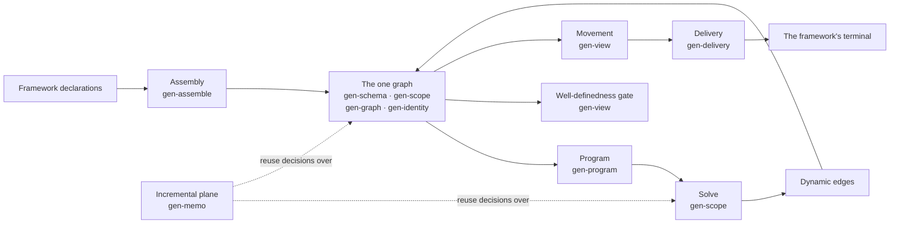

import { Aside, CardGrid, LinkCard } from '@astrojs/starlight/components';

gen is a substrate for building configuration frameworks in Nix. It is not itself a configuration
framework: it declares no domain entity and fixes no vocabulary. What it fixes is narrower and
harder to get right — one graph, one evaluator, one incremental plane over that evaluator, a query
algebra, and the interface through which a framework supplies its own names. Everything a framework
needs is built from those five things, and nothing else is load-bearing.

A roster of libraries implements that. Every one of them sits under a single hub, and every one of
them has exactly one job.

## One path, one library per stage

A framework's declarations reach a realized target by one path. Every stage on it is a single
library, and no library appears twice:



Assembly unions a framework's contributions commutatively — shapes merge, content folds — and never
evaluates; it hands its result to the one graph gen-schema, gen-scope, gen-graph and gen-identity
jointly maintain. From there a framework's policy declarations become a program that gen-scope
solves, producing dynamic edges that join that same graph rather than a second structure. A
scoped query — gen-view's movement — carries content to gen-delivery, which projects the declared
delivery classes and folds each one's collected content into a target-owned terminal. gen-memo sits
over the whole path as a decision layer, never itself evaluating.

That path is the substance of the other four pages in this section: [strata](/explanation/strata/)
is why each stage's library is only allowed to depend downward, [the graph
model](/explanation/graph-model/) is what a node and an edge are, [policies](/explanation/policies/)
is how declarations become the program gen-scope solves, and [execution](/explanation/execution/)
is what "gen-scope solves" and "gen-memo decides reuse" actually mean.

## One concern per library

The roster is not a convention — it's an enumerated, total set of formal arguments. A library that
isn't named there doesn't wire into the hub at all:

```nix file=<rootDir>/lib/mkGenLibs.nix#L42-L63

```

Every one of them belongs to exactly one of four ordered strata, plus a fifth,
unordered lifecycle state for a library on its way off the roster. That total assignment — and why
a member can't hold two of them — is [the next page](/explanation/strata/).

## The substrate names nothing of a framework's domain

No domain entity or framework concept appears in gen's own types, kinds, labels, options, error
text or documentation, except as an invented example — a library needing a worked case invents one
rather than borrowing a real framework's words. That's what makes the same substrate usable by
frameworks with nothing in common beyond composing through it.

<Aside type="caution" title="Where the seam still shows">
  One exception is live rather than settled: the hub's own delivery projection currently hardcodes
  the name of the registry it selects. A framework naming its registry anything else gets an empty
  projection with no error, until that selection is made a parameter instead of a constant. It's
  recorded here rather than smoothed over, because a substrate that names nothing of a framework's
  domain is a claim worth being able to falsify.
</Aside>

## Keep reading

<CardGrid>
  <LinkCard title="Strata" description="Why every library sits in exactly one of five buckets." href="/explanation/strata/" />
  <LinkCard title="The graph model" description="Nodes, labelled edges, and querying instead of assembling." href="/explanation/graph-model/" />
  <LinkCard title="Policies" description="How declarations become the program gen-scope solves." href="/explanation/policies/" />
  <LinkCard title="Execution" description="The sole evaluator, and the plane that decides reuse over it." href="/explanation/execution/" />
</CardGrid>
