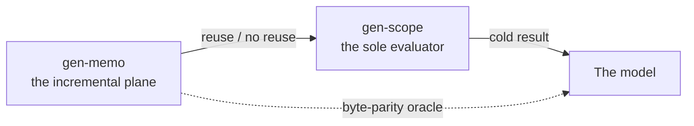

import { Aside, LinkCard } from '@astrojs/starlight/components';

One library is allowed to evaluate. Everything else — assembly, the graph, delivery, the query
algebra — is data flow around that one point, never a second place where evaluation happens.

## The sole evaluator

gen-scope is the sole evaluator, and it's kept thin on purpose: Nix's own laziness does the
scheduling, and nothing else in the roster evaluates at all. That's a load-bearing constraint, not
a style preference — it's what makes a single incremental plane definable in the first place. If
evaluation could happen in more than one place, "decide whether to reuse" would need to mean
something different in each of them.

A scanner checks the rest of the roster for evaluation-driving constructs outside gen-scope on
every run. It's worth being precise about what that scanner can and can't tell you: "anything that
evaluates, wherever it's hosted" is a property of running code, not of source text, and that
property isn't statically decidable in general. The scanner necessarily under-approximates it. A
green run is a true statement about the scanner — it found nothing it's built to find — and it is
not a proof that nothing in the ecosystem evaluates outside gen-scope. Sole evaluation is a strong,
actively-checked design rule; treat it as that, not as a formally proven invariant.

## What never evaluates

Several stages are explicit about the other half of this line. Assembly unions a framework's
contributions and derives structural declarations, and the toolkit never evaluates while doing it.
gen-inspect interrogates an already-materialized graph — which nodes exist, which edges are
declared, which a policy produced and why — and implements no semantics of its own; it never
evaluates either. gen-memo, covered next, is defined by *not* evaluating. None of these are
claiming to be fast substitutes for evaluation — they're claiming to not need it, which is a
different and checkable thing.

## The incremental plane

gen-memo is the one incremental plane over the evaluator: a decision layer that never evaluates,
only decides reuse. Its definition is not "usually agrees with a fresh run" — it's a byte-parity
oracle against cold evaluation. A plane output has to be byte-identical to what a full, cold
evaluation would have produced, and a plane that accumulates its own evaluation state to get there
has failed by construction, not merely underperformed. Deciding reuse and computing a result are
kept strictly separate; gen-memo only ever does the first.

That split — a rebuilder that decides what changed from a scheduler that decides what to run —
is Mokhov, Mitchell & Peyton Jones's build-systems-à-la-carte line of work; see [Mokhov et al.
(2018)](/reference/papers/mokhov-2018-build-systems-a-la-carte/) for the theory gen-memo's
definition is drawn from.

<Aside type="tip" title="Reading a memo decision">
  A "reuse" decision from gen-memo is a claim you can check the same way the plane itself is
  defined: against a cold evaluation of the same input. If the two ever disagree, that's not a
  performance regression to tune away — it's the plane's own definition failing, which is why the
  byte-parity oracle is the bar rather than a nice-to-have.
</Aside>

## Keep reading

<LinkCard
  title="Architecture"
  description="How the sole evaluator and the incremental plane fit into the rest of the path."
  href="/explanation/architecture/"
/>
