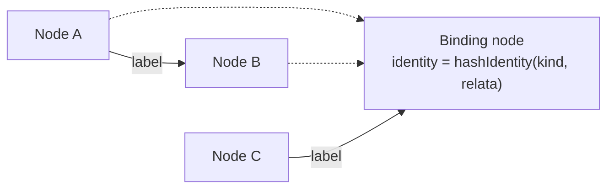

import { Aside, LinkCard } from '@astrojs/starlight/components';

There is exactly one graph, and exactly one node notion. Not one per framework, not one per kind —
one, full stop, and there is no second node notion anywhere in the substrate.

## What a node is

A node is a position with attributes and incident labelled edges: an identity, a set of attributes
— some declared, some computed — and the labelled edges touching it. That's the whole notion. A
"kind" is not a second one: a kind is a schema-level declared datum carried by a node, and nothing
in the substrate reads a kind to decide what a node *is*. `aspect` and `entity` are gen-declared
kinds like any other a framework might declare — the substrate treats them exactly the way it
treats a kind it's never seen before.

## What an edge is — and isn't

An edge carries a label and nothing else. No interpreted payload rides on an edge, which is what
forces reification: any relation that needs to carry content can't be represented as an edge, so it
has to be a node instead — a **binding node**, a reified relation identified by which relation it
is and what it relates:

```text
identity = hashIdentity <relation-kind> { <relatum label> = <that relatum's identity>; … }
```

Each relatum contributes its own derived identity to that hash, never its bare name, so a binding
node's identity is not a function of what anything happens to be called. The relation kind is
required, and an empty one is refused by name rather than silently collapsing two different
relations that happen to share relata into one node. Minting is staged, too: a binding may only
relate nodes minted in a strictly earlier pass, so the identity computation can never need its own
result to proceed.



## One minting authority

Every node either carries an identifier, or it cannot be an edge endpoint. Identity-bearing kinds
additionally carry a derived identity, and there is exactly one authority that mints it:
`hashIdentity`. Nothing else in the substrate invents one. Where an identity can't be minted
totally — an ordinary kind derives its identity keys reflected from its own options, never from a
separately maintained declaration — the substrate refuses rather than guessing. A missing identity
is a refusal, not a silently invented placeholder.

## Query instead of assemble

The graph is the configuration, not a staging area you build once and then read from. Every derived
view is a named materialized query result — a projection has a name and a defining query, or it is
not a view. Content movement
between nodes is the same idea from two ends: a *collector* is a receiver-rooted query, a
*broadcaster* is a producer's declaration paired with a standing query. Neither one copies content
around by hand — both are queries against the one graph, and the graph doesn't change shape to
answer them.

<Aside type="note" title="Why this matters for a framework">
  A framework built on gen doesn't hand-assemble a tree and then hope its structure holds. It
  declares nodes and labelled edges, and everything downstream — merging, delivery, dynamic
  edges from [policies](/explanation/policies/) — is a query over that one graph. There's no
  second representation to keep in sync with the first.
</Aside>

The reference-attribute-grammar literature is where the mechanism for keeping two relations —
declared and dynamic — coherent over one structure comes from; see [Hedin
(2000)](/reference/papers/hedin-2000-reference-ag/) if you want the theory underneath this.

## Keep reading

<LinkCard
  title="Policies"
  description="How declarations become the dynamic edges that join this same graph."
  href="/explanation/policies/"
/>
