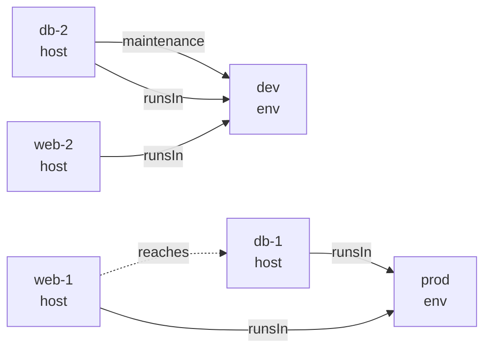

Four hosts run in two environments, and one database is in maintenance. An access rule lets a web
server reach a database in its own environment unless the database is in maintenance. The inspector
loads the hosts, the declared `runsIn` and `maintenance` edges, and the rule, which derives
`reaches` edges that no declaration states.

```nix title="platform-inspector.nix"
let
  gen = (builtins.getFlake "github:sini/gen").lib.mkGenLibs { };
  register = {
    host = {
      web-1 = { role = "webserver"; };
      web-2 = { role = "webserver"; };
      db-1  = { role = "database"; };
      db-2  = { role = "database"; };
    };
    env = { prod = { }; dev = { }; };
  };
  relations = {
    runsIn = { web-1 = [ "prod" ]; db-1 = [ "prod" ]; web-2 = [ "dev" ]; db-2 = [ "dev" ]; };
    maintenance = { db-2 = [ "dev" ]; };
  };
  fact = label: src: dst: { head = "${label}:${src}:${dst}"; relata = [ src dst ]; };
  reach = web: db: env: {
    head = "reaches:${web}:${db}";
    pos = [ "runsIn:${web}:${env}" "runsIn:${db}:${env}" ];
    neg = [ "maintenance:${db}:${env}" ];
    relata = [ web db ];
  };
  program = gen.program.program {
    frozen = builtins.attrNames register.host ++ builtins.attrNames register.env;
    declarations = [
      (fact "runsIn" "web-1" "prod") (fact "runsIn" "db-1" "prod")
      (fact "runsIn" "web-2" "dev")  (fact "runsIn" "db-2" "dev")
      (fact "maintenance" "db-2" "dev")
      (reach "web-1" "db-1" "prod")
      (reach "web-2" "db-2" "dev")
    ];
  };
  model = gen.program.model { inherit program; interpretation = [ ]; prior = null; complete = true; };
in
gen.inspect.mkInspector { inherit register relations program model; }
```

```console
$ nix eval --impure --json --file platform-inspector.nix \
    --apply 'i: i.query "SELECT src, dst FROM edge WHERE label = '\''reaches'\''"'
[{"dst":"db-1","src":"web-1"}]
```

`web-2` does not reach `db-2`, because `db-2` is in maintenance. The same inspector answers why the
one derived edge exists:

```console
$ nix eval --impure --json --file platform-inspector.nix \
    --apply 'i: (i.why "reaches:web-1:db-1").derivations'
[{
  "fired": [
    {"atom": "runsIn:web-1:prod", "sign": "pos", "verdict": "true"},
    {"atom": "runsIn:db-1:prod", "sign": "pos", "verdict": "true"},
    {"atom": "maintenance:db-1:prod", "sign": "neg", "verdict": "false"}
  ],
  "rule": {
    "head": "reaches:web-1:db-1",
    "neg": ["maintenance:db-1:prod"],
    "pos": ["runsIn:web-1:prod", "runsIn:db-1:prod"]
  }
}]
```

The rule fired because both positive conditions are true and the negative one is false.

## What you can do

| Feature | Functions | Purpose |
|---|---|---|
| Load a graph | `inspect.mkInspector { register; relations; program; model; }` | One set of facts from nodes, declared edges and solved rules |
| Read the facts | `.facts` | Nodes, edges with their origin, tables per kind, and a gen-graph value |
| Query with SQL | `.query "SELECT …"` | Filter, join, sort and limit over `edge`, `reaches` and one table per kind |
| Query with selectors | `.select selector` | The same filters as data; the result is again a set of facts |
| Explain | `.why atom` | The rule and conditions behind a derived edge or a reachability row |
| Render | `.render.mermaid facts` | A mermaid diagram, with derived edges dashed |
| Explain reuse | `memo.why`, `whyFor`, `whyNot`, `whyNotFor` | Why an incremental run did or did not recompute a node |
| Trace values | `.provenance` on module and settings results | Which file or layer set each value (see [Typed Configuration](/features/configuration/)) |

## Details

### Rendering

`render.mermaid` turns the facts into a diagram. Declared edges are solid. Edges a rule derived are
dashed:

```console
$ nix eval --impure --raw --file platform-inspector.nix --apply 'i: i.render.mermaid i.facts'
```



### Reachability

`reaches` is a table with the columns `src`, `dst`, `via` and `why`. A row says `dst` is reachable
from `src` along edges labelled `via`. `via = '*'` means any label, and every node reaches itself:

```console
$ nix eval --impure --json --file platform-inspector.nix \
    --apply 'i: i.query "SELECT dst FROM reaches WHERE src = '\''web-1'\'' AND via = '\''*'\'' ORDER BY dst"'
[{"dst":"db-1"},{"dst":"prod"},{"dst":"web-1"}]
```

The rule engine computes reachability. Path enumeration is not offered, because a cyclic graph has
infinitely many paths. Ask `reaches` for what a node reaches and `why` for the edge that carries it.

### Names are checked

A query naming a table, column, label or `via` that does not exist fails with the list of names
that do. Without this, `WHERE label = 'reach'` would return `[]` and read as "the rule produced
nothing":

```
gen-inspect: unknown label 'reach'; known: maintenance, runsIn, reaches
```

## Common errors

gen fails early and names what it expected. Each message below comes from the current code.

| Error text | Cause | Fix |
|---|---|---|
| `gen-graph.dependents: 'edges' is not an option of this door; the options are closed (accepted: 'maxIter')` | The graph was passed where the options set goes | Call `dependents { } graph node`; see [Graphs and Queries](/features/graphs/) |
| `gen-graph.ancestorsOf: required field 'parent' is missing` | The accessor record lacks a field this query reads | Add the field, here `parent = id: …` |
| ``gen-merge: a definition for option `ssh.port' is not of the expected type: expected type 'int' but value "22" is of type 'string'`` | A definition has the wrong type | Fix the value, or the option's `type` |
| ``gen-merge: option `ssh.prot' does not exist (no freeformType to absorb it)`` | A definition has no matching option, often a typo | Correct the path, or declare the option |
| `gen-schema: ref field 'home' on kind 'admin': reference 'web-3' not found in instance registry (available: db-1, web-1)` | A reference names an instance the registry does not have | Use one of the listed names, or add the instance |
| `gen-aspects.includes (aspect 'webserver', include position 0): reference 'sshd' names no entry of the registry` | An `includes` entry names no aspect | Correct the name; the position is the index in `includes` |
| `gen-program: the membership 'primary:db-1' is UNDEFINED — …` | `included` was read on an atom whose rules contradict each other | Read `flag` and handle `"U"`; see [Rules](/features/rules/) |
| `gen-program: 'a' is not in the frozen set of relata …` | A rule's `relata` names an identifier missing from `frozen` | Add it to `frozen` |
| ``gen-delivery: project: no node selector — `selectNodes` is required and has no default. …`` | `project` was called without `selectNodes` | Pass `selectNodes = values: values.hosts` or your registry's path |
| ``gen: flakeModule: `gen.nodeRegistryPath` is required and has no default — … Declared top-level keys: …`` | The flake module has no registry path | Set `gen.nodeRegistryPath` to one of the listed keys' registry; see [Delivery](/features/delivery/) |
| `gen-inspect: unknown label 'reach'; known: …` | A query names a label, table or column that does not exist | Use a name from the list |

### Reading a trace

Nix prints the frames that led to an error above the message, and truncates them by default. The
last line starting with `error:` is gen's message. Pass `--show-trace` to see every frame. The
first frame naming your own file is usually the line to change.

---

**Provided by** gen-inspect (facts, SQL, selectors, `why`, rendering) and gen-memo (explaining
reuse). The error messages come from the library each row names.
