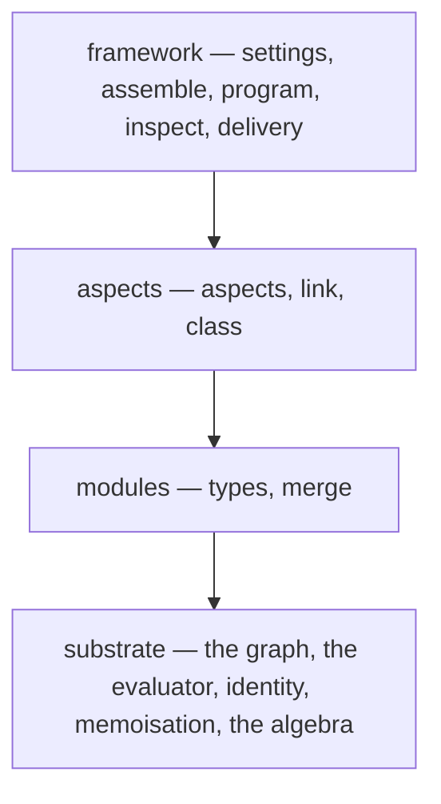

import { Card, CardGrid, LinkCard, Aside } from '@astrojs/starlight/components';
import HeroGraph from '../../components/HeroGraph.astro';

<HeroGraph />

## You already know this

Package dependencies are a graph. So is the OS configuration that installs them.
So is the network the host sits on, and the services depending on each other
across it, and the fleet those hosts belong to.

Every one of those is the same shape. You describe each in a different language,
with a different tool, and you reconcile them by hand — at the seams, where the
interesting failures live.

## Every config tool makes you assemble

You write the modules. You wire them together. You remember which host needs
which user, which user needs which shell, which shell needs which package — and
you encode all of it by hand, in the order the evaluator happens to need.

The relationships were the interesting part, and you spent your evening on the
plumbing.

## So declare the relationships instead

Systems, users, packages and services are nodes. What relates them is an edge.
Policies are small programs that produce more edges from the ones you wrote.

Then you ask the graph a question, and it answers. One model and one evaluator,
whether you are describing a laptop or a fleet.

```nix
{ genValues, ... }:
{
  networking.hostName = genValues.hosts.igloo.name;
}
```

That value was not assembled. It was resolved — by one evaluator, over a graph
you described rather than built.

<CardGrid>
  <Card title="Nodes and edges" icon="puzzle">
    Hosts, users, aspects. Relations are data you can query, not call order you
    have to get right.
  </Card>
  <Card title="Policies produce edges" icon="random">
    A rule fires when its conditions hold and adds to the graph. Logic
    programming, with the termination question taken seriously.
  </Card>
  <Card title="One evaluator" icon="approve-check">
    Every fixpoint goes through one place. A load-bearing design rule, with a
    scanner that reports any second one.
  </Card>
</CardGrid>

## We did not invent this. We implemented it.

Configuration resolution is name resolution, and name resolution over a scope
graph is a reachability query with a well-formedness condition on the paths.
Policies producing edges is Datalog, and negation in Datalog is exactly where
the semantics get delicate — so gen solves stratum by stratum, and a rule can
never observe its own still-open conclusion. Incremental rebuild is
demand-driven recomputation with early cutoff.

Each of those is a settled result with a proof behind it. Building on them is a
design decision, and it is why a question about gen's behaviour has somewhere to
go beyond the source.

<CardGrid>
  <LinkCard title="The reading list" href="/reference/reading-list/"
    description="Which published work carries which part of the system." />
  <LinkCard title="Policies" href="/explanation/policies/"
    description="Rules, stratification, and what happens under a negative cycle." />
</CardGrid>

## One concern per library

Each layer is a set of flakes you can depend on alone. Take the graph algebra
without the module system. Take the module system without the aspect layer. The
hub is a convenience, and a consumer reading `inputs.gen-graph.lib` never needs
it.

Every member declares exactly one stratum, and that declaration is total — a
library cannot join the roster without one, so the layering is a build error
rather than a diagram.



<CardGrid>
  <LinkCard title="The roster" href="/libraries/roster/"
    description="Every library, what it owns, and how to depend on one alone." />
  <LinkCard title="Strata" href="/explanation/strata/"
    description="Why the layering is total, and what it rules out." />
</CardGrid>

## We wrote down what we owe you

Every promise in gen names the command that enforces it. Every roster library is
free of `nixpkgs.lib` — checked by a scanner, per repository, on every run. Full
nixpkgs enters at the terminals alone. Where the enforcer is a person rather than
a command, we say so.

<CardGrid>
  <LinkCard title="Trust" href="/trust/"
    description="Each promise, the mechanism behind it, and how it fails." />
  <LinkCard title="Validation" href="/validation/"
    description="The oracles every landing passes, and what each one proves." />
</CardGrid>
