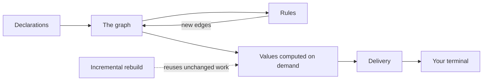

import { CardGrid, LinkCard } from '@astrojs/starlight/components';

gen is a set of Nix libraries for building configuration frameworks. It models machines, users
and features as nodes in one graph, joined by labelled edges. It provides the graph and its
queries, a typed module system that runs without nixpkgs, reusable features called aspects, rules
that add edges, values computed on demand, incremental rebuilds, and delivery of each node's
configuration to a builder you supply. A framework built on gen brings its own words, such as
`host` or `role`.

## Core concepts

| Concept | What it is | Read more |
|---|---|---|
| Node | One thing in your configuration, such as a host, a user or an aspect. It has an identity, attributes and the edges that touch it. | [Your Configuration as a Graph](/understand/graph/) |
| Kind | The declared shape of a family of nodes: options, types and defaults. Every instance of a kind gets an identity derived from its content. | [Stable Identity for Everything](/understand/identity/) |
| Edge | A labelled relation from one node to another. You can ask which nodes a path of edges with given labels leads to. | [Your Configuration as a Graph](/understand/graph/) |
| Aspect | A named, reusable bundle of configuration. It carries content for each class, such as `nixos`, and includes other aspects through edges. | [Reusable Features](/understand/features/) |
| Rule | A statement that a relation holds between nodes when some conditions hold and others do not. gen solves all rules together as one logic program. | [Rules That Add Relationships](/understand/rules/) |
| Terminal | The function that receives a node's finished configuration for one class, such as a NixOS system builder. You supply it. | [From an Aspect to a NixOS System](/guides/aspects-to-nixos/) |

The [terminology](/reference/terminology/) page defines every other term.

## How the pieces fit

A framework's declarations travel one path to a built system. gen evaluates one graph once and
hands each ecosystem its finished configuration, which that ecosystem's own builder, such as
NixOS's system builder or a terminal you supply, then builds. The Understand and Features sections
cover each stage.

1. Declarations from many files merge into one set of typed nodes, each with a stable identity.
2. Rules read the graph and add edges. A rule can require another rule's conclusion to be false.
   When two rules each require the other to be false, both get the value *undefined*, and reading
   either one as true or false fails with an error.
3. Attributes on each node are computed when something reads them, and at most once.
4. Delivery collects each node's content for each class and hands it to the terminal for that
   class.
5. After an edit, gen reuses every result the edit did not affect. The output is always identical
   to a full rebuild.

## What you get

**Identity pays for itself three times.** Every machine, user and feature gets an identity computed
from its content, so two things with the same content always get the same identity.

- *Reuse.* After an edit, gen reuses every result the edit did not affect, and the output is
  identical to a full rebuild. Re-evaluating six edits against earlier work costs a quarter of
  evaluating each from scratch, and on a real set of three NixOS machines an edit to one skips two
  thirds of the composition work for all three. [Benchmarks](/benchmarks/) has the figures.
- *Errors with a cause.* Every declared option records which file set it, at which priority, and
  which definitions it replaced. Reporting a failure against the node and feature that caused it
  builds on the same identity, and is on the [Roadmap](/roadmap/).
- *Introspection.* gen loads the graph and the results of its rules into one set of facts. You
  can query them with SQL, ask why a relationship exists and get the rules that produced it, and
  draw the graph as a diagram. See [Inspection](/features/inspection/).

**It works with the module systems you already use.** gen's module system follows the nixpkgs
rules for everything the two share, and a test suite compares the two on every change. It also
accepts nixpkgs' own option types: driven with real nixpkgs `lib.types` and `mkOption`, it gives
byte-identical output on gen's benchmark corpus, so existing modules and custom types come along
during a port. A feature's NixOS content stays an ordinary NixOS module, and gen passes values into
modules written for other evaluators through the same argument injection it uses for its own.
[Coming From the Module System](/guides/from-module-system/) shows both.

## Using gen

Each library is its own flake, so you can depend on one, such as the graph library alone. The gen
flake gathers them all: `inputs.gen.lib.mkGenLibs { }` returns every library under a short name,
such as `gen.graph`, `gen.merge` and `gen.aspects`. [Libraries](/reference/libraries/) lists each
one and the feature pages it provides.

gen is pre-release, and its APIs are still changing. [Roadmap](/roadmap/) says what ships now and
what comes next.

## Where to go next

<CardGrid>
  <LinkCard
    title="Building a framework"
    href="/understand/core-concepts/"
    description="Start with Core Concepts, then the Features pages and the Reference section."
  />
  <LinkCard
    title="Using den"
    href="/guides/den-on-gen/"
    description="den is a framework built on gen. How its features map onto gen's toolkit."
  />
  <LinkCard
    title="Using gen as a library"
    href="/guides/getting-started/"
    description="Answer a question about your own data with one library."
  />
  <LinkCard
    title="Deciding whether to build on gen"
    href="/trust/"
    description="Every guarantee gen makes, and the check that holds it."
  />
</CardGrid>
