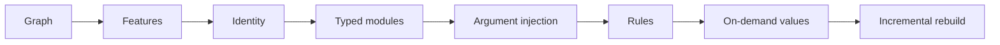

gen is a set of Nix libraries for building configuration frameworks. It stores a configuration as a
graph, groups settings into reusable features, gives every part a stable identity, and computes
only what a reader asks for. This section explains each of those ideas on its own page, using one
example that grows as you read.

## The running example

Most pages follow a small **homelab**:

- two hosts, `laptop` and `server`
- two users, `alice` and `bob`
- three features: `ssh`, `monitoring` and `desktop`

The laptop is a desktop machine. The server runs ssh and monitoring. Alice has an account on both
hosts, and Bob only on the server.

Two pages need more structure than a few machines have, so they use a small **web platform**: two
environments (`dev` and `prod`), two datacenters (`us-east` and `us-west`), and hosts that are
either a `webserver` or a `database`. That example asks which webservers may reach which
databases.

## The ideas, in reading order

| page | the idea in one sentence |
|---|---|
| [Your Configuration as a Graph](/understand/graph/) | Hosts, users and features are nodes. Their relations are labelled edges, and you ask questions by following labels. |
| [Reusable Features](/understand/features/) | A feature is a named bundle of configuration that any host can use, and features can include each other. |
| [Stable Identity for Everything](/understand/identity/) | Every node gets an identity computed from its definition, so equal things are recognised as equal. |
| [An Enhanced Module Type System](/understand/module-types/) | Options have types, definitions merge by priority, and gen records which file set every value. |
| [Automatic Argument Injection](/understand/argument-injection/) | A module asks for the values it needs, such as the host it configures, and gen passes them in. |
| [Rules That Add Relationships](/understand/rules/) | Rules decide which relations hold, and each relation that holds becomes an edge. |
| [Values Computed on Demand](/understand/on-demand/) | A node's values are computed when something reads them, from the node and its neighbours. |
| [Rebuilding Only What Changed](/understand/incremental/) | After an edit, gen reuses what did not change and gives the same result as a full run. |
| [Which Tool for Which Job](/understand/choosing/) | A goal-by-goal guide to the mechanisms above. |

## Words used throughout

- A **node** is one thing in your configuration: a host, a user, a feature.
- An **edge** connects two nodes and carries a **label**, such as `user` or `feature`.
- A **kind** declares the shape of a node: its options and their types. A **registry** holds the
  nodes of one kind.
- An **aspect** is gen's name for a feature: a named bundle of configuration.
- A **class** is the target a piece of configuration is written for, such as `nixos`.
- A **rule** states that a relation holds when some facts hold and others do not.

The [terminology](/reference/terminology/) page defines every other term.

## Where the ideas come from

Each page ends with a short paragraph on the research behind its mechanism, with a link to our
reading of the paper. The [papers](/reference/papers/) section has the full list.
